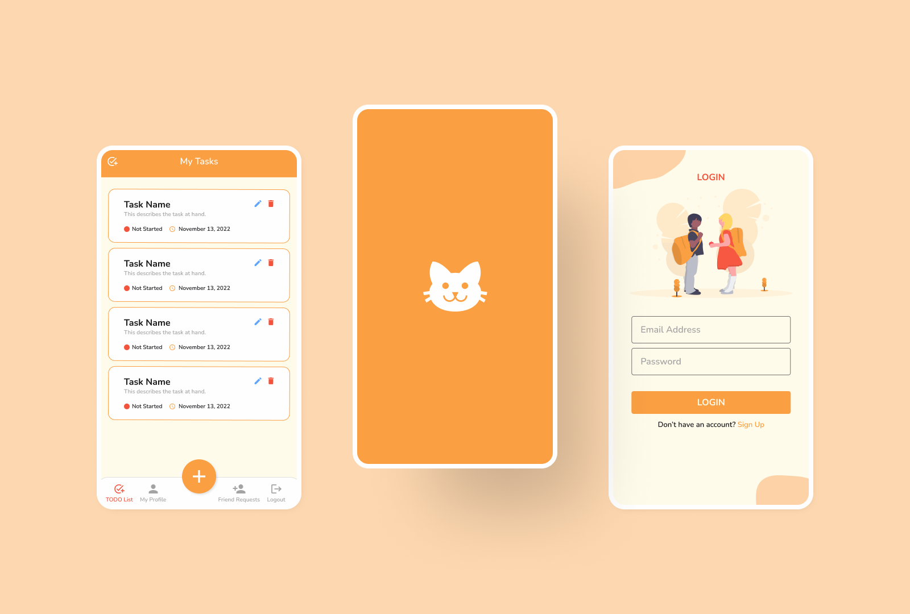

<!-- Banner -->

<!-- Header -->

  <h1><b>📝 Tomodachi 友達</b></h1>
  
A Flutter todo app where you can share your tasks with your friends!

 

<!-- App Preview -->
## 📱&ensp;App Preview

<!-- Features -->
## ✨&ensp;Features
- **View, add, edit,** and **delete** the details of your tasks.
- **Search** and **add** other users as **friends!**
- **Collaborate** with your friends by being able to **edit** the details of their **tasks!**
- Be notified **an hour before** the deadline of your tasks.
